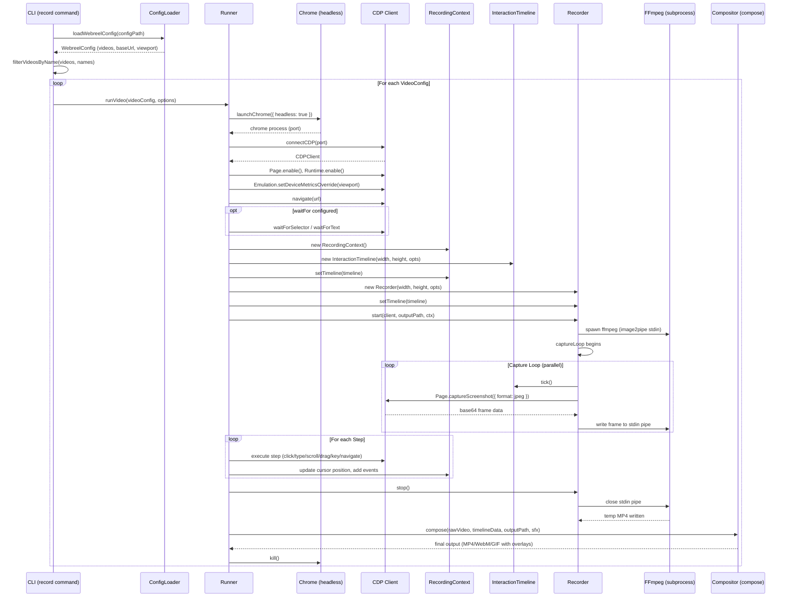
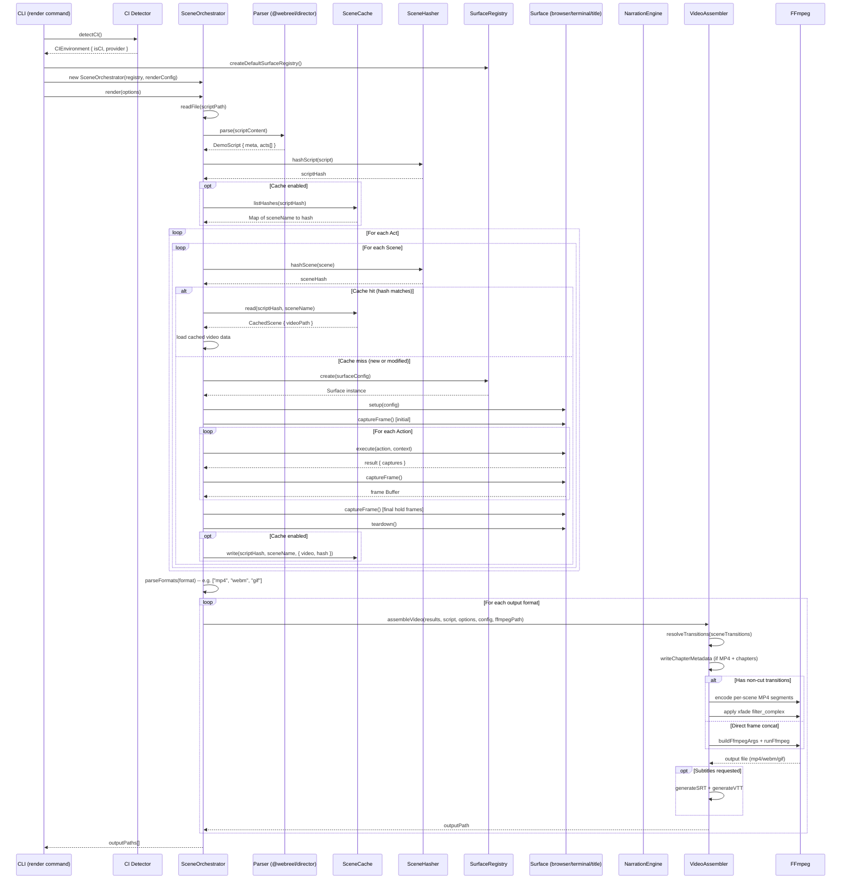
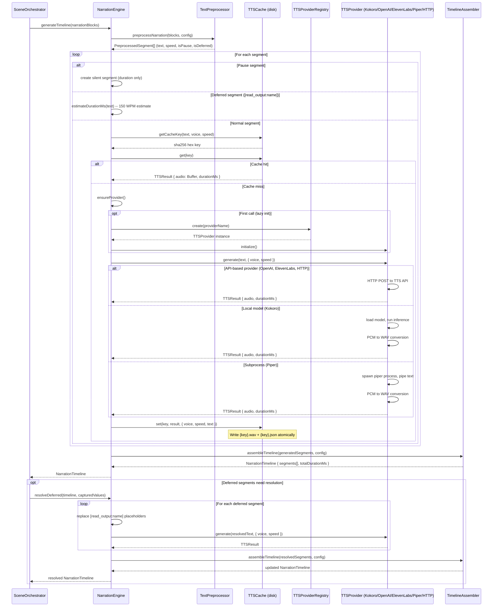
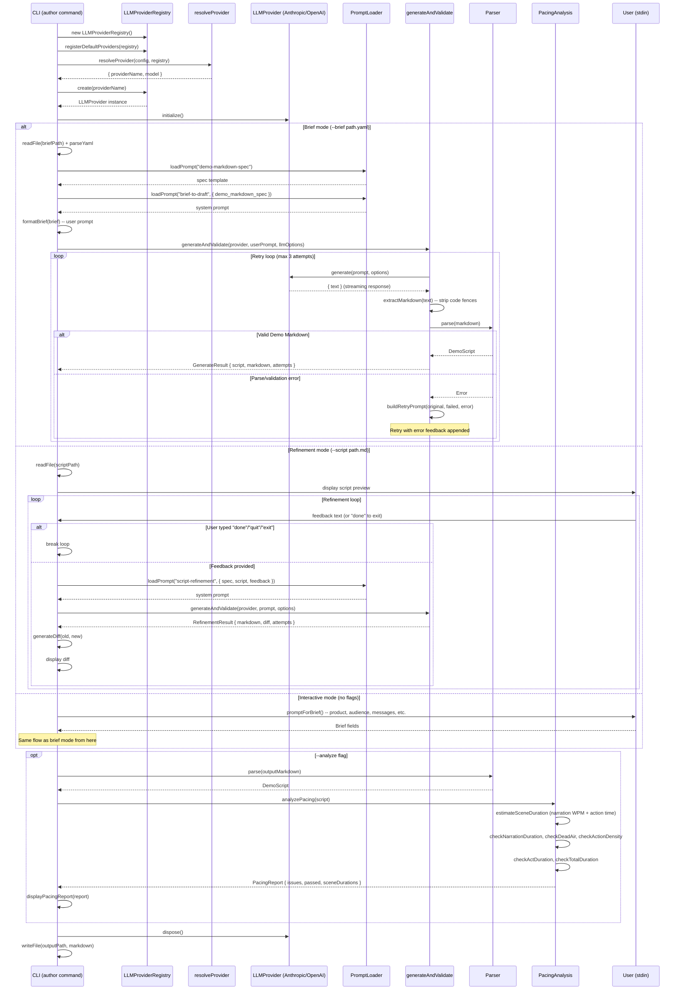
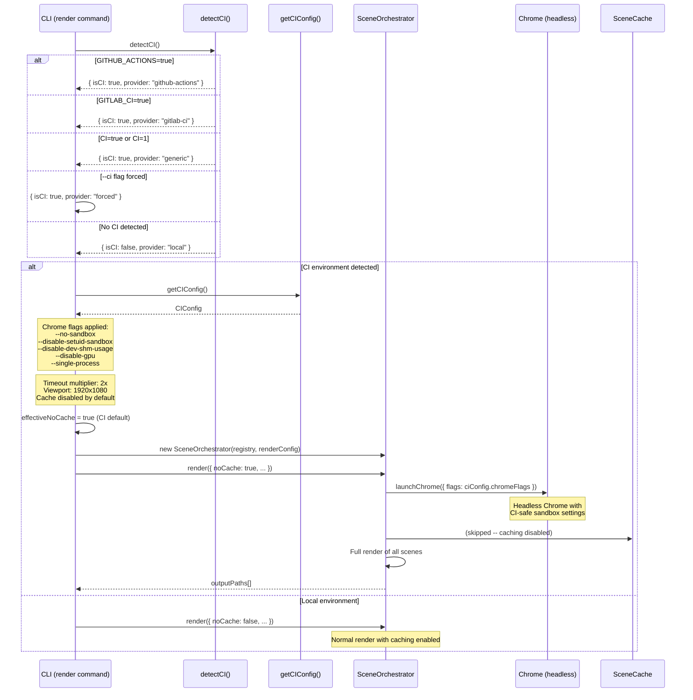
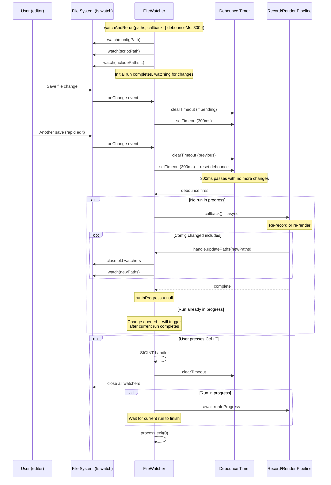
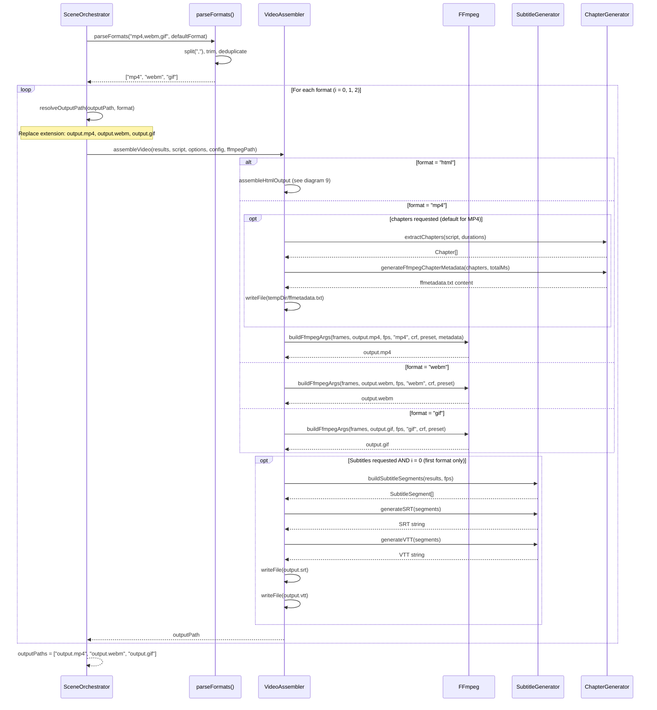
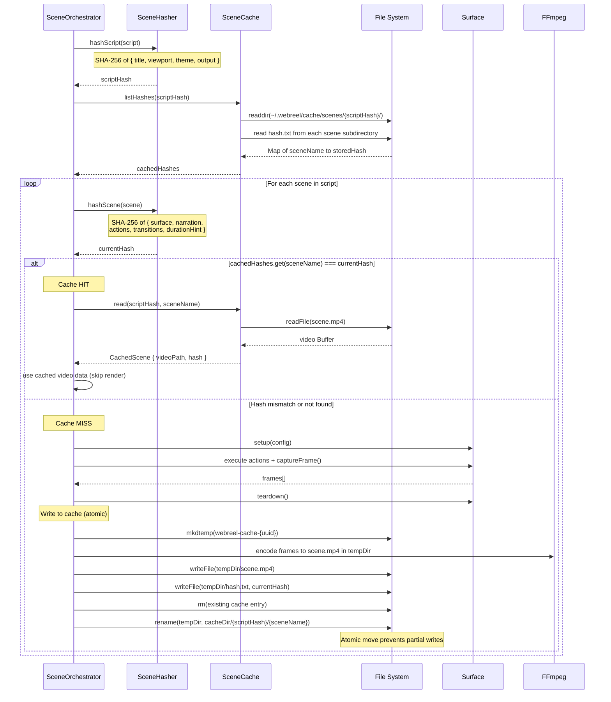

# Sequence Diagrams

This document contains Mermaid sequence diagrams for the major pipelines and flows in the webreel system. Each diagram corresponds to a distinct subsystem or command-level workflow.

---

## 1. Legacy Recording Pipeline (`webreel record`)

The legacy recording pipeline processes JSON config files through the CLI runner. It launches a headless Chrome instance via CDP, executes scripted interaction steps (click, type, scroll, drag, etc.), captures frames in real-time via `Page.captureScreenshot`, pipes them to an ffmpeg subprocess, and finalizes the output through the compositor with cursor and keystroke overlays.



---

## 2. Demo Markdown Render Pipeline (`webreel render`)

The render pipeline processes Demo Markdown scripts (`.md` files) through the parser, scene orchestrator, surfaces, and video assembler. The parser converts Markdown into a DemoScript IR. The SceneOrchestrator iterates over acts and scenes, creating surfaces via a registry, executing actions, and capturing frames. The VideoAssembler handles encoding to the target format(s) with optional transitions, chapters, and subtitles.



---

## 3. TTS Narration Flow

The narration engine orchestrates text-to-speech generation through a provider registry. It preprocesses narration blocks into sentence-level segments, checks a disk-based cache (keyed by SHA-256 of text + voice + speed), and delegates to the appropriate TTS provider on cache miss. Supported providers include Kokoro (local model), OpenAI TTS, ElevenLabs, Piper (subprocess), and HTTP (generic REST endpoint). Generated audio is cached as WAV files for reuse.



---

## 4. LLM Authoring Pipeline (`webreel author`)

The authoring pipeline generates Demo Markdown scripts from YAML brief files using an LLM provider. It supports three modes: brief-to-draft generation, interactive brief building, and iterative script refinement. The core generation uses a self-healing loop that parses and validates LLM output, retrying with error feedback on failure. Optional pacing analysis checks timing and narration density.



---

## 5. CI Rendering Flow

When webreel runs in a CI environment, it detects the CI provider, applies safe configuration defaults (Chrome sandbox flags, extended timeouts, viewport overrides), and disables scene caching by default since CI caches are often ephemeral. This flow shows the detection and configuration sequence before rendering begins.



---

## 6. Watch Mode Flow

Both `webreel record` and `webreel render` support `--watch` mode for iterative development. The file watcher monitors config/script files for changes, debounces rapid edits (300ms default), and re-runs the recording or rendering pipeline. Concurrent execution protection ensures a new run does not start while the previous one is still in progress.



---

## 7. Multi-Format Output Flow

When multiple output formats are requested (e.g., `--format mp4,webm,gif`), the render pipeline produces one output file per format from the same set of rendered frames. The format string is parsed and deduplicated by `parseFormats()`. Each format is encoded sequentially through the video assembler. Subtitles are generated only once alongside the first format.



---

## 8. Scene Caching Flow

The scene cache enables incremental re-rendering by storing per-scene video segments keyed by content hash. On each render, the scene hasher computes a SHA-256 of the scene's content (surface config, narration, actions, transitions). If the hash matches a cached entry, the cached video is loaded directly. On cache miss, the scene is fully rendered and the result is written to cache with atomic write semantics (temp directory then rename) to prevent corruption from interrupted writes.



---

## 9. Interactive HTML Output Flow

When the output format is `html`, the assembler produces a self-contained HTML file with an embedded video player. Frames are first encoded to a temporary MP4 via ffmpeg, then the MP4 is read and base64-encoded. Chapter markers are extracted from the script's act/scene structure, and subtitle segments are built from narration blocks. Everything is injected into an HTML template that includes a video player with chapter navigation and subtitle display, requiring zero external dependencies.

```mermaid
sequenceDiagram
    participant VA as VideoAssembler
    participant FFmpeg as FFmpeg
    participant FS as File System
    participant ChGen as ChapterGenerator
    participant SubGen as SubtitleGenerator
    participant HtmlGen as HtmlGenerator
    participant Template as HtmlPlayerTemplate

    VA->>VA: format = "html" detected
    VA->>FS: mkdtemp(webreel-html-{random})
    FS-->>VA: tempDir path

    Note over VA: Step 1: Encode frames to temporary MP4
    VA->>VA: assembleDirectFrames(results, tempDir, tempMp4, config)

    loop Write all frames to tempDir
        VA->>FS: writeFile(frame_000001.png, frameBuffer)
    end

    VA->>FFmpeg: buildFfmpegArgs(frame_%06d.png, video.mp4, fps, "mp4", crf, preset)
    FFmpeg-->>VA: tempDir/video.mp4 written

    Note over VA: Step 2: Compute scene durations
    VA->>VA: sceneDurations = Map of sceneName to durationMs

    Note over VA: Step 3: Build subtitle segments
    VA->>SubGen: buildSubtitleSegments(results, fps)
    SubGen-->>VA: SubtitleSegment[] (startMs, endMs, text)

    Note over VA: Step 4: Generate interactive HTML
    VA->>HtmlGen: generateInteractiveHTML({ videoPath, script, durations, subtitles })

    HtmlGen->>FS: readFile(tempDir/video.mp4)
    FS-->>HtmlGen: video Buffer

    HtmlGen->>HtmlGen: videoBase64 = buffer.toString("base64")

    HtmlGen->>ChGen: extractChapters(script, sceneDurations)
    ChGen-->>HtmlGen: Chapter[] { title, startMs }

    HtmlGen->>Template: generateHtmlPlayer({ videoBase64, mimeType, title, chapters, subtitles })

    Note over Template: Embeds video as data:video/mp4;base64,...<br/>Injects chapter navigation controls<br/>Injects subtitle overlay display<br/>Self-contained -- zero external deps

    Template-->>HtmlGen: complete HTML document string
    HtmlGen-->>VA: HTML string

    VA->>FS: writeFile(outputPath, html)
    VA->>FS: rm(tempDir, { recursive: true })

    VA-->>VA: outputPath (e.g., demo.html)
```
